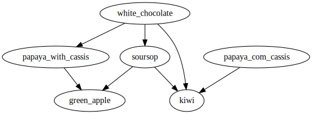

# The Horror Ice Cream Parlor 🍦

With the end of winter and the arrival of spring days, his cousin has just opened an ice cream shop that promises to be the success of the city, only he has always been the weirdo in the family and the ice cream shop has some rules that worry the relatives:
- The ice cream shop has cups for 2 and 3 scoops of ice cream;
- Your cousin never puts a strong flavor (eg, mega-ultra-power-100% chocolate) on top of a mild flavor (eg, yogurt), because then no one tastes the smooth one when they get to it;
- Your cousin has a who-is-stronger-than-who list to go by when pouring cups (in his opinion, but that's another story);
 - He never accepts repeat flavor orders, so people can try more flavors;


Now his family is a little concerned that these conditions could greatly limit the amount of orders that can be fulfilled. They ask you (the family computer expert, since he installs Windows for everyone) to take the who-is-stronger-than-who list and tell them how many different cups of ice cream are possible in the ice cream parlor.
This is an example of a list of flavors, corresponding to the drawing on the side. He says, for example, that soursop should be served before kiwi.

```
white_chocolate -> papaya_with_cassis
white_chocolate -> soursop
white_chocolate -> kiwi
papaya_with_cassis -> green_apple
papaya_com_cassis -> kiwi
soursop -> green_apple
soursop -> kiwi
```

<p align="center">
  
</p>
